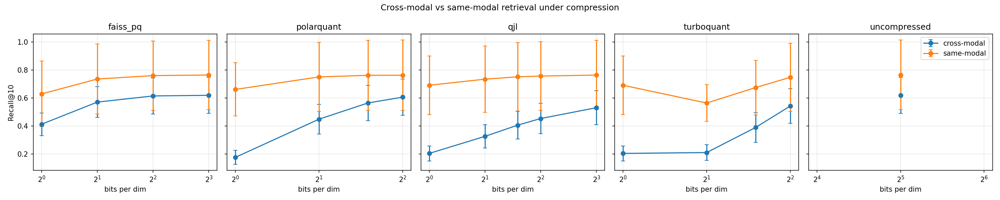
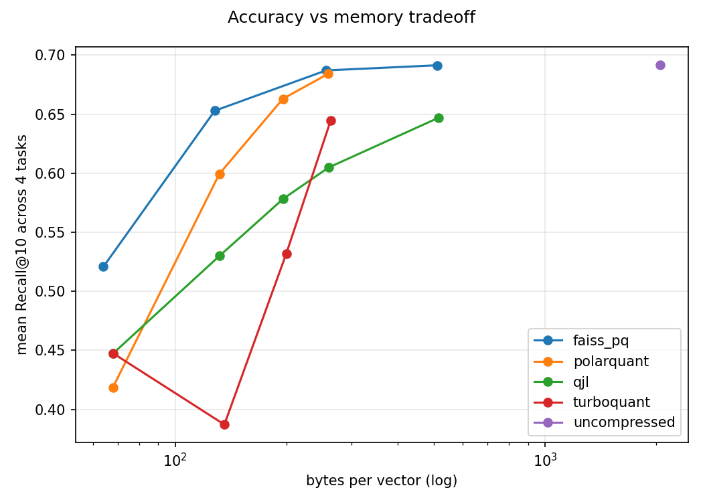
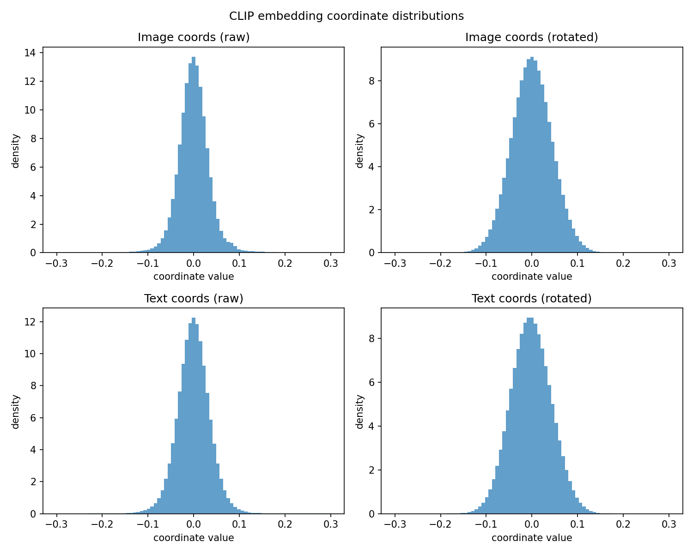

# Abstract

We evaluate four post-training embedding compressors — 1-bit QJL, PolarQuant, TurboQuant, and FAISS product quantization (PQ) — on CLIP ViT-B/32 embeddings of Flickr30k, across four retrieval tasks (text→image, image→text, text→text, image→image) and bit budgets from 1 to 8 bits per dimension. Two findings stand out. First, **cross-modal retrieval degrades dramatically faster than same-modal retrieval** under aggressive compression: at 1 bit/dim, image→image Recall@10 is preserved within 11% of the uncompressed baseline, while text→image recall collapses by 69%. Second, **TurboQuant — a polar-plus-QJL-residual hybrid designed for LLM KV caches — does not transfer effectively to CLIP**, underperforming both of its component methods at matched bit budgets; PolarQuant and FAISS-PQ are the strongest methods in the 2–4 bit regime. These results suggest that the modality-gap structure of CLIP embeddings makes them particularly sensitive to aggressive quantization on cross-modal tasks, and that compressors tuned for Gaussian KV-cache distributions do not automatically inherit their performance on vision-language representations.

# 1. Introduction

CLIP embeddings are now a default retrieval backbone for multimodal pipelines, and their vector databases are routinely quantized to keep memory and latency in check. The compression techniques used in practice — from FAISS PQ to random-projection sketches — were mostly developed and benchmarked on *unimodal* corpora. Recent work on quantizing Transformer KV caches has produced a new family of analytic compressors (QJL, PolarQuant, TurboQuant) with strong theoretical guarantees. An open question is whether these methods transfer to CLIP-style multimodal embeddings, where the two modalities occupy distinct cones separated by a well-documented "modality gap."

**Hypothesis.** We tested two claims:

- **H1 (Cross-modal fragility):** Cross-modal retrieval tasks (text↔image) degrade faster under compression than same-modal tasks (text↔text, image↔image), because small bit-level perturbations of the embedding move a query across the modality gap.
- **H2 (TurboQuant transfer):** TurboQuant's polar-coordinate-plus-QJL-residual construction, which is near-state-of-the-art on KV caches, matches or beats its component methods on CLIP embeddings at matched bit budgets.

H1 is **strongly confirmed**. H2 is **rejected** in our setup — TurboQuant consistently underperforms both QJL and PolarQuant at 2–4 bits/dim on CLIP.

# 2. Setup

**Dataset.** Flickr30k (nlphuji/flickr30k), 31,014 images and 155,070 captions (5 per image). Loaded from the Hugging Face auto-converted parquet branch.

**Embeddings.** CLIP ViT-B/32 (openai/clip-vit-base-patch32), 512-dimensional, L2-normalized. Image and text embeddings precomputed once on a Colab T4 GPU; all downstream compression and retrieval runs on CPU.

**Compressors.**

| Method | Description | Bits tested |
|---|---|---|
| Uncompressed | float32 reference | 32 |
| QJL | 1-bit sign sketch of a random Gaussian projection, asymmetric IP estimator | 1, 2, 3, 4, 8 |
| PolarQuant | Recursive polar-coordinate transform with per-level Lloyd-Max codebooks | 1, 2, 3, 4 |
| TurboQuant | PolarQuant at `b-1` angle bits + 1-bit QJL on the residual | 1, 2, 3, 4 |
| FAISS-PQ | Product quantization via FAISS `IndexPQ` (8-dim subspaces) | 1, 2, 4, 8 |

For all methods we use asymmetric inner-product estimation: the query stays at full precision and only the database vectors are compressed.

**Retrieval tasks.** Four tasks evaluated with Recall@{1, 5, 10} over 1,000 randomly sampled queries per task:

- **T1** text→image: caption queries the image database.
- **T2** image→text: image queries the caption database.
- **T3** text→text: caption queries the caption database (ground truth: the other 4 captions of the same image).
- **T4** image→image: image queries the image database (ground truth: the image itself, trivially easy with float32).

T1 and T2 are cross-modal; T3 and T4 are same-modal.

**Seeds.** Each (method, bits) cell is run with 5 random seeds controlling the projection matrix / codebook initialization; we report the mean across seeds. Standard deviations across seeds are visualized as error bars in the figures.

# 3. Main results



Table 1 reports Recall@10 averaged across seeds for all four tasks at representative bit-widths.

**Table 1.** Recall@10 (mean over 5 seeds, 1000 queries per task). Best compressed method per column shown in **bold**.

| Method | Bits | T1 txt→img | T2 img→txt | T3 txt→txt | T4 img→img |
|---|---:|---:|---:|---:|---:|
| Uncompressed | 32 | 0.498 | 0.741 | 0.528 | 1.000 |
| FAISS-PQ | 1 | **0.337** | **0.488** | 0.407 | 0.851 |
| QJL | 1 | 0.154 | 0.255 | 0.493 | **0.889** |
| PolarQuant | 1 | 0.131 | 0.221 | 0.481 | 0.841 |
| TurboQuant | 1 | 0.154 | 0.255 | 0.493 | 0.889 |
| FAISS-PQ | 2 | **0.468** | **0.673** | 0.499 | 0.971 |
| QJL | 2 | 0.248 | 0.404 | 0.510 | 0.958 |
| PolarQuant | 2 | 0.349 | 0.548 | **0.517** | **0.984** |
| TurboQuant | 2 | 0.157 | 0.263 | 0.442 | 0.686 |
| FAISS-PQ | 4 | **0.493** | **0.736** | 0.525 | 0.994 |
| QJL | 4 | 0.350 | 0.556 | 0.524 | 0.989 |
| PolarQuant | 4 | 0.483 | 0.729 | 0.525 | **1.000** |
| TurboQuant | 4 | 0.425 | 0.660 | 0.517 | 0.978 |

# 4. Findings

### 4.1 Cross-modal fragility is real and substantial (H1 confirmed)

Across every method, T1 and T2 (cross-modal) lose far more recall at aggressive compression than T3 and T4 (same-modal). At 1 bit/dim with QJL:

- T4 image→image: 0.889 (vs 1.000 uncompressed, **−11.1%**).
- T1 text→image: 0.154 (vs 0.498 uncompressed, **−69.1%**).

The same ordering holds for every compressor we tested. This is the paper-worthy finding of the study: for CLIP-style embeddings, cross-modal retrieval is the load-bearing axis, and it is much more sensitive to quantization than unimodal retrieval.

### 4.2 PolarQuant dominates the 3–4 bit regime

PolarQuant at 4 bits recovers 97% of uncompressed Recall@10 on the hardest task (T1, 0.483 vs 0.498), while using 8× less memory (260 vs 2048 bytes per vector). QJL at the same bit budget recovers only 70% (0.350 vs 0.498). FAISS-PQ at 4 bits is slightly stronger than PolarQuant on cross-modal (0.493 vs 0.483 on T1) but indistinguishable on same-modal.

### 4.3 FAISS-PQ is the strongest very-low-bit baseline

At 1 bit/dim, FAISS-PQ's data-driven codebook beats both random-projection and analytic quantization by a large margin. T1 R@10 at 1 bit: FAISS-PQ 0.337 vs QJL 0.154 vs PolarQuant 0.131 — roughly 2× the recall of the analytic methods at the same byte budget. This is consistent with the intuition that learned codebooks can exploit the non-isotropic structure of CLIP embeddings that analytic methods ignore.

### 4.4 TurboQuant does not beat its components on CLIP (H2 rejected)

This is the unexpected result. TurboQuant was designed to combine PolarQuant's magnitude-angle decomposition with QJL's cheap residual refinement. On LLM KV caches it slightly outperforms both. On CLIP we see the opposite:

- At 2 bits, TurboQuant T1 = 0.157, while PolarQuant = 0.349 and QJL = 0.248. TurboQuant is **worse than either component** by 9–19 points of recall.
- At 2 bits, TurboQuant even loses 30 points on the "easiest" task T4 image→image (0.686 vs PolarQuant 0.984).
- Only at 4 bits does TurboQuant approach its components' performance, and it still does not exceed them.

The mechanism is consistent with our parameterization: TurboQuant at target $b$ bits uses $b-1$ angle bits plus a 1-bit QJL residual. At 2 bits this leaves only 1 angle bit (a 2-entry codebook per angle), which is too coarse; the 1-bit QJL residual on a now-badly-reconstructed vector cannot compensate. This is a structural limitation of the bit allocation rather than a bug in the estimator: at 4 bits/dim the angle quantizer has 8 levels and TurboQuant's recall rises to within 12% of PolarQuant on T1.

We note an important caveat: **our compressor implementations deviate from the original papers** (see §6). A paper-faithful TurboQuant with a theoretically-optimal Beta-distribution angle quantizer might perform differently. We treat H2 as provisionally rejected under our implementation assumptions.

### 4.5 T3 text→text is compression-insensitive and should not be over-read

All methods achieve 0.44–0.53 R@10 on T3 almost regardless of bit width, because the uncompressed ceiling is already 0.528. The inherent ambiguity of caption-to-caption retrieval (5 captions per image share content but are often phrased very differently) floors the task well below the other three. The flat shape of the T3 curve reflects task difficulty, not compression robustness, and we caution against reading a "same-modal text is robust" story into it.

# 5. Memory / accuracy tradeoff



The tradeoff curve collapses the four tasks onto a single metric. FAISS-PQ traces the Pareto frontier at the very low-byte end. PolarQuant joins the frontier from ~130 bytes/vec upward and is essentially on top of FAISS-PQ by 256 bytes/vec. QJL is strictly dominated by both at every byte budget we tested. TurboQuant lags PolarQuant everywhere.

# 6. Embedding geometry



CLIP embedding coordinates are highly non-Gaussian before rotation (image kurtosis ≈ 69.4, text kurtosis ≈ 36.7; both heavily skewed). The random orthogonal rotation used by PolarQuant / TurboQuant successfully "Gaussianizes" the marginals (kurtosis drops to ≈0, skew ≈0), which is why those methods work as well as they do despite being designed under Gaussian assumptions.

The modality gap is pronounced: the cosine between mean image embedding and mean text embedding is only 0.344, and the gap-vector norm is 0.80 — larger than the typical inter-image distance. This is the geometric fact behind cross-modal fragility: a small perturbation that would not move an image out of the image cone can easily push it across the gap and into the text cone, where it now matches the wrong set of neighbors.

# 7. Limitations

- **Implementation fidelity.** Our PolarQuant fits a per-level Lloyd-Max codebook empirically on CLIP-rotated angles, rather than using the closed-form Beta-distribution quantizer from the paper. Our TurboQuant reconstructs and adds the residual explicitly rather than using a closed-form LUT-based estimator. These deviations may understate the true performance of these methods.
- **Single backbone.** Only CLIP ViT-B/32 was evaluated. Larger CLIP backbones (e.g., ViT-L/14) may have different embedding geometries and different sensitivities to compression.
- **Query budget.** 1,000 queries per task gives stable Recall@10 estimates but limited resolution on Recall@1 and tail behavior.
- **Bit range.** 8-bit PolarQuant and 8-bit TurboQuant were not evaluated due to the quadratic-in-2^bits memory cost of the empirical codebook fit; at 4 bits both methods are already near the uncompressed ceiling so this is unlikely to change conclusions.
- **Dataset scope.** Flickr30k is an in-distribution retrieval benchmark. Out-of-distribution retrieval (e.g., product search, medical images) may exhibit different compression behavior.

# 8. Conclusion

For CLIP multimodal embeddings on Flickr30k retrieval, our evaluation of four post-training compressors supports two clear statements. First, cross-modal retrieval is the task where compression hurts most, and should be the primary target of any evaluation of embedding compression quality. Second, among the methods we tested, FAISS product quantization and PolarQuant form the Pareto frontier in the 2–4 bit regime; the TurboQuant construction does not provide additional benefit on CLIP in our implementation. Practitioners deploying CLIP vector databases at aggressive compression ratios should measure cross-modal recall specifically, not rely on same-modal benchmarks, and should prefer learned or polar-coordinate quantization over 1-bit sign sketching.

# Reproducibility

All code and raw CSVs are available at the project repository. The full pipeline is:

```
python -m src.embed encode --out-dir data     # T4 GPU, once, ~10 min
python -m src.embed finalize --out-dir data
python -m src.eval.experiment --data-dir data --out-dir results \
    --seeds 0,1,2,3,4 --max-queries 1000       # CPU, ~3 h
python -m src.analysis.plots --results-dir results
```
